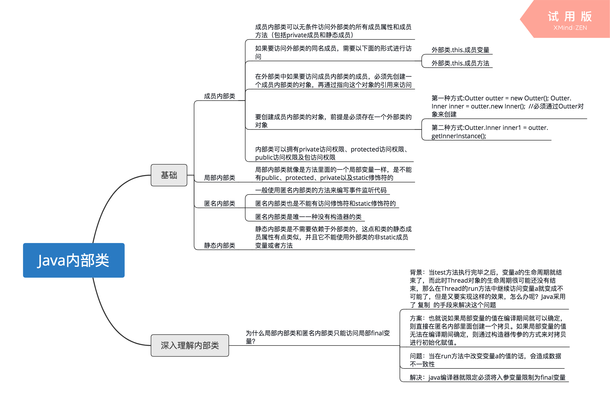

# JAVA-面向对象

1、<a href="#基本概念">基本概念</a>

2、<a href="#封装">封装</a>

3、<a href="#继承">继承</a>

4、<a href="#多态">多态</a>

5、<a href="#内部类">内部类</a>

**下面先介绍一下基本概念，然后再从我们熟知的封装、继承、多态三大部分进行讲解，不要死记概念，去刷相关的笔试题，然后再找找相关概念，下面直接阅读会让人产生眩晕感，之后会慢慢加点问题改进的**

# 1、基本概念
<a name="基本概念"></a>
**类声明**：一个源文件中只能有一个 public 类且源文件的名称应该和此类名相同，可以有多个非 public 类。此源文件属于哪个包，就在首行标明 package 包名；

类包括 外部类 和 内部类，内部类 还包括 成员内部类（单独定义） 和 局部内部类（某个方法里定义，就像是方法中的一个局部变量，不能有修饰符，或者只能是 abstract 或者 final）。

**外部类**：的上一级是包，所以他只有两个作用域，同一个包内和任意位置。因此只能有两个访问控制修饰符，默认 和 public，非访问控制修饰符有多个可选 abstract, final。

**内部类**：的上一级是外部类，有四个作用域，当做普通的成员对待，三个修饰符都可以（默认不用修饰符）。但如果是在方法体内（局部内部类），那么是不可以使用访问控制修饰符的。

**JAVA 包（package）**：包主要用来对 类和接口 进行分类。当开发 Java 程序时，可能编写成百上千的类，因此很有必要对类和接口进行分类。有关联关系的类放在一个源文件中，该文件属于哪个包，那么就在该源文件的首行写 package 语句，而不是你想象的那样将许多源文件打包。

1、为了更好地组织类，Java 提供了包机制。包是类的容器，用于分隔类名空间。如果没有指定包名，所有的示例都属于一个默认的无名包。Java 中的包一般均包含相关的类，Java 是跨平台的，所以 Java 中的包和操作系统没有任何关系，Java 的包是用来组织文件的一种虚拟文件系统。

2、import 语句并没有将对应的 Java 源文件拷贝到此处，仅仅是引入，告诉编译器有使用外部文件，编译的时候要去读取这个外部文件。

3、Java 提供的包机制与 IDE 也没有关系。

4、定义在同一个包（package）内的类可以不经过 import 而直接相互使用，因为只有两种关系，要么 public 全局，要么就是默认的包内。

**import**：在 Java 中，如果给出一个完整的限定名，包括包名、类名，那么 Java 编译器就可以很容易地定位到源代码或者类。Import 语句就是用来提供一个合理的路径，使得编译器可以找到某个类。如果源文件包含 import 语句，那么应该放在 package 语句和类定义之间。

# 2、封装
## 2.1、4 种访问控制修饰符
**共有的【public】**：对所有类可见，Java 程序的 main()  方法必须设置成公有的，否则，Java 解释器将不能运行该类。

**受保护的【protected】**：对同一包内的类和所有子类可见。

**默认的【default 】**：在同一包内可见，不使用任何修饰符。

**私有的【private】**：在同一类内可见。主要用来隐藏类的实现细节和保护类的数据。类和接口不能声明为 private。

访问范围：【public】> 【protected】> 【default 】> 【private】

  

## 2.2、非访问控制修饰符：static、final、interface、abstract
为了实现一些其他的功能，Java 也提供了许多非访问修饰符（所有成员都肯定有访问控制修饰符，而非访问控制修饰符是可选的，可有可无）。

**static 修饰符**：用来创建类方法和类变量，这里叫**类方法**，就是静态方法。类的静态成员与类直接相关，与对象无关，在一个类的所有实例之间共享同一个静态成员

1、静态变量必须初始化（不赋值，系统会自动初始化），可以修改（例如我们常利用静态成员变量统计某个函数的调用次数）  
2、静态变量只能在类主体中定义，不能在方法中定义，静态方法也不行（不能修饰局部变量：局部变量，由于在方法中，方法中的变量都在栈中，随着方法的进栈出栈产生和销毁。所以不可以被static修饰。一旦被static修饰变量就属于类了），静态的都属于类，不属于实例方法。  
3、静态成员函数中不能调用非静态成员（实例变量 和 实例方法）：因为也许这个实例还没有产生。  
4、在类方法中不能使用super、this关键字。  
5、类方法不能被覆盖。   
6、非静态成员函数中可以调用静态成员

**final  修饰符**：用来修饰类、方法和变量。
1、final 修饰的类不能够被继承，如 String 类是不可变类  
2、修饰的方法不能被重写  
3、修饰的变量为常量，是不可修改的。赋值 final 修饰的变量有三种方式。（1、在声明时直接赋值，2、在构造函数中赋值，3、在初始代码块中进行赋值。）  

**abstract 修饰符**：用来创建抽象类和抽象方法。

**synchronized**： 用于多线程的同步。

**volatile**：修饰的成员变量在每次被线程访问时，都强制从共享内存中重新读取该成员变量的值。而且，当成员变量发生变化时，会强制线程将变化值回写到共享内存。这样在任何时刻，两个不同的线程总是看到某个成员变量的同一个值。

**transient**：序列化的对象包含被 transient 修饰的实例变量时，java 虚拟机(JVM)跳过该特定的变量。

```java
/*问：static class 对么？
static 不能用来修饰类，除非类是内部类，此时该类作为外部类的成员变量，可以用 static 修饰，
否则一般类（class）只有两种访问控制修饰符（+ abstract，final 这两种是非访问控制修饰符，可有可无）*/

private static int numInstances = 0 ; //构造一个私有的静态变量
private static void addInstance(){ //构造一个私有的静态函数
	numInstances++;
}

/*当用final修饰一个类时，表明这个类不能被继承。也就是说，如果一个类你永远不会让他被继承，就可以用final进行修饰。final 类中的成员变量可以根据需要设为 final，
但是要注意 final 类中的所有成员方法都会被隐式地指定为 final方法。
如果一个类不允许其子类覆盖某个方法，则可以把这个方法声明为 final 方法。使用final方法的原因有二：
1、把方法锁定，防止任何继承类修改它的意义和实现。 
2、高效，编译器在遇到调用 final 方法时候会转入内嵌机制，大大提高执行效率。 
*/
public final Class String{} // String 是不可变类
public static final int BOXWIDTH = 10; // 声明一个常量
```

**接口（interface）**
1、除非实现接口的类是抽象类或者接口，否则该类要定义接口中的所有方法  
2、接口可以继承（extends）接口，且是多继承  
3、接口不能用于实例化对象  
4、接口没有构造方法  
5、接口不能包含成员变量，除非是 public static final修饰的常量  
6、一个类可以同时实现多个接口，关键字是（implements）  

1、JDK1.8之前：
接口中只能有抽象方法：[（public  abstract可以省略）void  method();
全局静态常量：public static final 常量；
2、JDK1.8之后：
抽象，默认，静态方法：1、public abstract void method(); 2、public default void method(){有代码} 3、public static void method(){有代码} 注：接口中的静态方法可以直接使用，interface.method();

**新增静态方法和默认方法**：
1、因为静态方法不可以实例化，在接口中也是一样的 所以在接口中定义静态方法的作用就是静态方法的作用：不需要实例化，直接使用，节省内存空间。
2、默认方法是可以在接口中写执行体的。主要作用：
2.1、接口升级，可以避免改变其他实现类；函数拼接。
2.2、接口默认方法的”类优先”原则 ，若一个接口中定义了一个默认方法，而另外一个父类或接口中 又定义了一个同名的方法时，先调用类中的同名方法。
2.3、如果一个类实现多个接口。并且这些接口提供了一个具有相同名称和参数列表的方法（不管方法 是否是默认方法），那么必须覆盖该方法来解决冲突。子类必须指定覆盖哪个父类接口中的方法。

**abstract 修饰符**：修饰抽象类和抽象方法，声明抽象类的唯一目的是为了将来对该类进行扩充。
1、抽象类不能用来实例化对象，但是可以有构造方法（？？）
2、接口是公开的，里面不能有私有的方法或变量，是用于让别人使用的，而抽象类是可以有私有方法或私有变量的。
3、抽象类中也可以包含已经实现的方法，这是和接口的一个重要区别（现在可能不是了）。
4、抽象类中的抽象方法要加 abstract 关键字声明，但是接口中可以省略。
5、如果一个类包含抽象方法，那么该类一定要声明为抽象类，但是一个抽象类不一定有抽象方法。
6、抽象方法是一种没有任何实现的方法（不能有大括号），该方法的的具体实现由子类提供。
7、任何继承抽象类的子类必须实现父类的所有抽象方法，除非该子类也是抽象类。
8、abstract 不能与private、static、final或native并列修饰同一个方法。

```java
/*问：不能用来修饰 接口 里 方法的有哪些关键字？
答：不能用 private、protected，常用 public static final 修饰属性，public abstract 修饰方法，当然 java8 新
增 default、static 修饰方法。
(1)增加 default 方法。对已有的接口，如果想对接口增加一个新方法，那么需要对实现该接口的所有类进行修改，如果接口
的实现类很多，就会带来很大的工作量，而且还很容易破坏以前的代码，带来一些问题。如果把新的方法定义为 default 方
法，就可以避免对其他实现类的修改。Default 方法是非常有用的，通过在接口定义的方法的访问修饰符前加上关键字
default，那么实现类就无需提供该方法的实现了。
但是，这样也会有一个问题：如果接口 A 和接口 B 里有一个名字相同并且参数列表也相同的方法都被定义为了default方
法，那么当类 C 实现接口 A 和接口 B 的时候就会在编译时报错。由于是编译时报错，这个完全可以接受，当类 C 成功实现
了接口 A 和接口 B 以后（没有冲突），类 C 的实例就可以调用接口 A 和接口 B 里的 default 方法了。

(2)新增了 static 函数。static 修饰的方法也是非抽象方法，有自己的方法体，在接口中定义一个静态方法，该方法可以
直接用 接口名.方法名() 的形式来调用。相当于调用类的静态方法一样，给方法的调用带来了方便。

问：为什么是 public static final？
为什么是 public：因为接口必然是要被实现的，如果不是 public，这个属性就没有意义了；
为什么是 static：因为如果不是 static，那么由于每个类可以继承多个接口，那就会出现重名的情况；
为什么是 final：这是为了体现 Java 的开闭原则，因为接口是一种模板，既然是模板，那就对修改关闭，对扩展开放。

问：接口和抽象类有什么区别？
答：抽象类是对概念的归纳，接口是对功能的归纳。继承抽象类可以先完成一个总体需求，再增加一个额外的功能，而接口则
是强调对需求用户提供服务。需求不同，选择也会不一样。抽象方法不能定义方法体。*/

/*接口之间应该也是继承，而不是实现 implements 且可以是多继承*/
public interface interfaceOne extends interfaceTwo,interfaceThree,interfaceFour{}

/*接口中可以定义的变量和方法*/
interface Father{
    /*成员变量*/
    public static final int a = 1; // 不写修饰符也可以，默认是 public static final 修饰
    int b = 1; // 一般这么写，上面会提示冗余的修饰符

    /*成员函数*/
    public abstract void method(int a); //不写修饰符也可以，默认是 public abstract
    void method(); // 一般这么写，上面会提示冗余的修饰符
    
    /*静态方法，可以直接定义*/
    public static void testOne(){
        System.out.println("static method");
    } 
    
    /*默认方法，可以直接定义，且继承此接口的类无需重新实现此方法，可直接调用，对于后期修改非常友好*/
    public default void testTwo() {
        System.out.println("你好，中国！");
    }
}

/*抽象类：含有抽象方法的就是抽象类，其余和普通类相同*/
abstract class Caravan{ 
	private double price;
	public abstract void addPrice(); //抽象方法
    public abstract void method(){}; //错误，抽象方法不能有方法体，不是可选的。
}
```

# 3、继承（extends 或者 implements）
<a name="继承"></a>
1、类继承是用 extends，而接口是用 implements
2、类是单继承，接口可以多继承，接口可以继承多个接口
3、子类不可以继承父类的构造方法，只可以调用。（方法没有继承一说，要么重载，要么重写，或者调用父类的方法）
4、子类中所有的构造函数都会默认访问父类中的无参构造函数，因为默认第一行都会有super(); 当父类中存在有参构造器时，子类调用父类的无参构造函数时，必须提供无参构造器（因为这个时候，系统不会自动生成了）

```java
/*继承：从项目的角度来看：一般把通用的代码放入父类和接口中，这样可以避免大面积的重复代码*/

/*对于本题来说：在只想new Sub(5)的时候，父类先初始化了 int flag = 1，然后执行父类的构造函数Super（），父类构
造函数中执行的test（）方法，因子类是重写了test（）方法的，因此父类构造函数中的test（）方法实际执行的是子类的
test（）方法，所以输出为Sub.test() flag=1，接着执行子类构造函数Sub(5) 将flag赋值为5，因此输出结果Sub.Sub()
flag=5。输出：Sub.test() flag=1，Sub.Sub() flag=5
这题有没有让你对继承有了新的认识：不要把子类和父类分开，而是将父类放入到继承的子类中，当做一个大类来对待，这样
很多问题都能容易理解。
*/

class Super{  
    int flag = 1;
    Super(){ 
        test();
    }  
    void test(){
        System.out.println("Super.test() flag="+flag); 
    }
} 
class Sub extends Super{
    Sub(int i){  
        flag = i;  
        System.out.println("Sub.Sub() flag=" + flag); 
    }  
    void test(){  
        System.out.println("Sub.test()flag=" + flag); 
    }
    public static void main(String[] args) {  
        new Sub(5);
    }
}


/*子类继承父类的执行顺序**：在继承中代码的执行顺序为：
1.父类静态对象，父类静态变量，父类静态代码块
2.子类静态对象，子类静态变量，子类静态代码块
3.父类初始化代码块，父类构造函数
4.子类初始化代码块，子类构造函数*/
class A{
    public static int a = testA();
    public static int testA(){ //如果没有变量的调用，是不会初始化的。
        System.out.println("父类静态变量");
        return 1;
    }
    static {
        System.out.println("父类静态代码块");
    }
    {//这里也叫父类对象成员构造函数，就一大括号
        System.out.println("父类初始化块");
    }
    public A(){
        System.out.println("父类构造方法");
    }
}
public class B extends A{
    public static int b = testB();
    public static int testB(){
        System.out.println("子类静态变量");
        return 1;
    }
    static{
        System.out.println("子类静态代码块");
    }
    {//这里也叫子类对象成员构造函数，就一大括号
        System.out.println("子类初始化块");
    }
    public B(){
        System.out.println("子类构造方法");
    }
    public static void main(String[] args){
        new B();
    }
}
```

**重载**
1、是面向对象多态的一种主要实现方式
2、构造函数可以被重载但是不能被重写
3、Java 的方法重载，它们具有相同的函数名，但是参数一定不同，返回值，访问修饰符可能不同

**重写**：实现接口里的方法或者重写时，需要满足1、两同两大一小
两同：方法名、形参都要相同
两大：访问权限>=重写前(并解释)，返回值类型>=重写前
一小：抛出异常<=重写前
2、声明为 final 的方法不能被重写，final 修饰的类不能被继承；
3、声明 static 的方法不能被重写（实际是重写不了），父类调用的永远是父类的静态方法
4、 @Override ：不写也可以，但是写了有如下好处，1-可以当注释用，方便阅读；2-编译器可以给你验证 @Override下面的方法名是否是你 **父类** 中所有的，如果没有则报错。例如，你如果没写 @Override，而你下面的方法名又写错了，这时你的编译器是可以编译通过的，因为编译器以为这个方法是你的子类中自己增加的方法。

```java
/***重载与重写的区别？
参考博客:(https://blog.csdn.net/linzhaojie525/article/details/55213010)

问：子类将继承父类所有的数据域和方法？
正确，在一个子类被创建的时候，首先会在内存中创建一个父类对象，然后在父类对象外部放上子类独有的属性，两者合起来形成一个子类的对象。所以所谓的继承使子类拥有父类所有的属性和方法其实可以这样理解，子类对象确实拥有父类对象中所有的属性和方法，但是父类对象中的私有属性和方法，子类是无法访问到的，只是拥有，但不能使用。就像有些东西你可能拥有，但是你并不能使用。所以子类对象是绝对大于父类对象的，所谓的子类对象只能继承父类非私有的属性及方法的说法是错误的。可以继承，只是无法访问到而已。

问：子类可以继承和覆盖父类的类方法？
答：static 修饰的成员属于类成员，父类字段或方法只能被子类同名字段或方法遮蔽，不能被继承覆盖。

instanceof 判断是否是继承关系

Obeject 类是所有类的终极父类，任何类都是它的子类*/

System.out.println(dog instanceof Animal); //左边是子类 右边是父类

Animal cat = new Cat(){
    public String toString(){return "we change the toString methods";}
};
cat.staticMethod(); // 调用的是父类的静态方法，参考3.
System.out.println(cat); // 会自动调用 toString 方法
```

# 4、多态
```java
/*从项目的角度看：多态要解决的问题是，把抽象的业务逻辑和具体的实施细节分离，把做什么和怎么做分离。多态有修改点隔离 和 无障碍扩展 两大好处。
在实际的的开发过程中，这种继承加覆盖的方式可以做到以上两点好处：
1、修改代码时，只需要修改相应子类的代码即可，无需动其它类，即修改点隔离；
2、如果增加新的业务，只需要增加子类即可，即无障碍扩展；

向上转型：Animal animal = new Dog(); 会自动丢弃子类的方法，调用自己的方法时，如果子类有覆盖方法，则调用子类的，如果调用的方法是父类没有的，则编译会出错（所以如果使用父类进行调用一定是重写的方法！），具体参考下面的代码。
向下转型：Dog  dog = (Dog) animal; 要强转，调用子类重写的方法时会调用父类的方法。*/

class Animal {//注意默认是 default，public类 只能有一个，且必须与文件名相同
	private int i; //私有成员不能被继承
	public void move(){
		System.out.println("动物可以移动");
	}
	public void move(int x){//重载了 move 方法
		System.out.println("动物移动了 " + x + " 米");
	}
}

class Dog extends Animal{ 
    @Override //不写也可以，但是写了有上面介绍的好处
	public void move(){
		super.move(); //调用父类方法，使用 super 关键字
		System.out.println("小狗可以跑");
	}
     public void methodB(){
        System.out.println("extern method");
    }
}

public class test{
	public static void main(String args[]){
		Animal a = new Animal();
		Animal b = new Dog();
		a.move(); //调用父类函数
		b.move(); //调用子类函数
        /*b.methodB(); 编译错误？
        多态：父类里没有的函数，在多态实现的时候不能出现。
        */
	}
}

/*问：以下代码可以正常编译并运行么？
是可以的！即使 Test test = null;也会加载静态方法，所以test包含Test类中的初始化数据，静态的，构造的，成员属
性。额外，就算不是静态方法，编译也是可以通过的，只有在运行的时候才会报错。
如果一个成员被声明为static，它就能够在它的类的任何对象创建之前被访问，而不必引用任何对象
（跟类是否有static修饰无关）。*/
class Test{
	public static void hello(){
        System.out.println("hello");
    }
}
public class MyApp{
	public static void main(String[] args){
		Test test = null;
		test.hello();
	}
}

/*问：普通方法可以和类同名么？
答：可以的，不只是构造函数，普通函数也可以和类同名。
public void Parent(){} 也是可以的普通方法。*/

/*问：构造函数能重载但不能覆盖？下面这个方法会报错么？
回答：会的，由于子类的构造函数什么都没写，所以系统会默认的添加super()；来调用Parent类中无参的构造函数，而父类中没有，则报错。*/
class Parent{
	private int value;
	public Parent(int val){
        this.value = val;
    }
}
class SubClass extends Parent{
	public SubClass(int i){
        //可以在这里添加 super(i); 否则系统会默认添加super();找不到父类的无参构造方法报错。
    }
}

/*问：输出的值为多少？
答：22 34 17*/
class Test {
    public static void main(String[] args) {
        System.out.println(new B().getValue());
    }
    static class A {
        protected int value;
        public A (int v) {
            setValue(v);
        }
        public void setValue(int value) {
            this.value= value;
        }
        public int getValue() {
            try {
                value ++;
                return value;
            } finally {
                this.setValue(value);
                System.out.println(value);
            }
        }
    }
    static class B extends A {
        public B () {
            super(5);
            setValue(getValue()- 3);
        }
        public void setValue(int value) {
            super.setValue(2 * value);
        }
    }
}
```

# 5、内部类


特点：静态内部类才可以声明静态方法，静态方法不可以使用非静态变量。
```java
/*在Java中，可以将一个类定义在另一个类里面或者一个方法里边，这样的类称为内部类，广泛意义上的内部类一般包括四种：成员内部类，局部内部类，匿名内部类，静态内部类 。

1.成员内部类
（1）该类像是外部类的一个成员，可以无条件的访问外部类的所有成员属性和成员方法（包括private成员和静态成员）；
（2）成员内部类拥有与外部类同名的成员变量时，会发生隐藏现象，即默认情况下访问的是成员内部类中的成员。如果要访问
外部类中的成员，需要以下形式访问：【外部类.this.成员变量  或  外部类.this.成员方法】；
（3）在外部类中如果要访问成员内部类的成员，必须先创建一个成员内部类的对象，再通过指向这个对象的引用来访问；
（4）成员内部类是依附外部类而存在的，也就是说，如果要创建成员内部类的对象，前提是必须存在一个外部类的对象；
（5）内部类可以拥有private访问权限、protected访问权限、public访问权限及包访问权限。如果成员内部类用private修
饰，则只能在外部类的内部访问；如果用public修饰，则任何地方都能访问；如果用protected修饰，则只能在同一个包下或
者继承外部类的情况下访问；如果是默认访问权限，则只能在同一个包下访问。外部类只能被public和包访问两种权限修饰。

2.局部内部类
（1）局部内部类是定义在一个方法或者一个作用域里面的类，它和成员内部类的区别在于局部内部类的访问仅限于方法内或者该作用域内；
（2）局部内部类就像是方法里面的一个局部变量一样，是不能有public、protected、private以及static修饰符的。

3.匿名内部类
（1）一般使用匿名内部类的方法来编写事件监听代码；
（2）匿名内部类是不能有访问修饰符和static修饰符的；
（3）匿名内部类是唯一一种没有构造器的类；
（4）匿名内部类用于继承其他类或是实现接口，并不需要增加额外的方法，只是对继承方法的实现或是重写。

4.静态内部类
（1）静态内部类是不需要依赖于外部类的，这点和类的静态成员属性有点类似；
（2）不能使用外部类的非static成员变量或者方法。*/


/*局部内部类：在某个函数中*/
public void fun(){
    abstract class innerClassOne{}
    final class innerClassTwo{}
    class innerClassThree{}
}
    
/*匿名内部类：创建了一个匿名内部类，并将所创建的匿名对象赋给 Object (多态：子类对象赋给超类引用)。同时，该匿名内部类重写了 Object 类的 equals 方法。*/
public class TestObj{ 
    public static void main(String[] args){
        Object o = new Object(){
            public boolean equals(Object obj){
                return true;
            }
        }; 
        System.out.println(o.equals(“Fred”));
    }
} 

/*静态内部类*/
public class Single{
	private Single(){}
	private static class SingleHandler{
        // 这里为什么是 private 类型的
		private static final Single INSTANCE = new Single();
	}
	public static final Single getInstance(){
		return SingleHandler.INSTANCE;
	}
}
```
